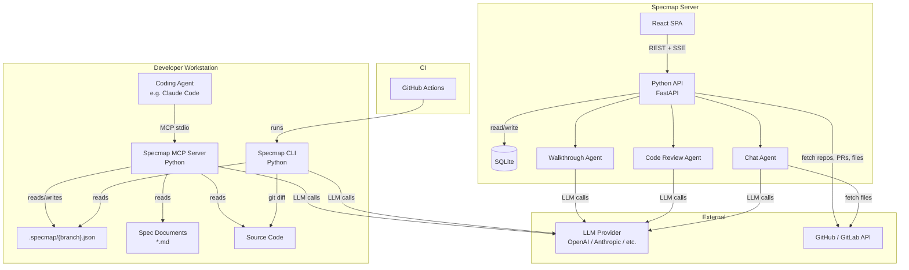
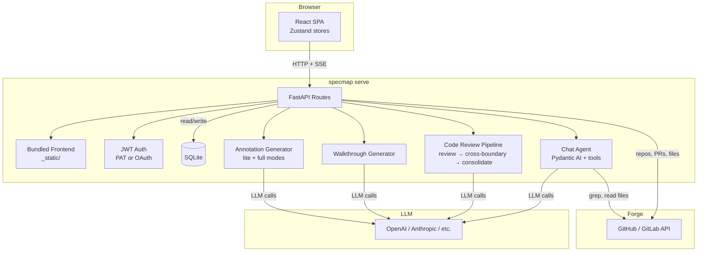

# Architecture

## System Diagram

## Data Flow

1. **Agent changes code** -- the coding agent creates or modifies source files
2. **Annotation generation** -- via MCP tool call (`specmap_annotate`), CLI (`specmap annotate`), or the web UI
3. **Diff analysis** -- `git diff` finds changes (full diff on first push, incremental diff on subsequent pushes)
4. **LLM annotation** -- code changes and spec sections are sent to the LLM, which generates natural-language descriptions with `[N]` spec citations
5. **Persist** -- annotations are written to `.specmap/{branch}.json` with the current `head_sha`
6. **Review** -- in the web UI (walkthroughs, code review, chat) or in CI (validation)

## Component Responsibilities

| Component | Language | Responsibility | Makes LLM calls? |
|---|---|---|---|
| Web UI | React/TS | Browse PRs, display annotations, walkthroughs, code review, chat | Via API server |
| API Server | Python (FastAPI) | REST API, annotation generation, forge integration, auth | Yes |
| CLI | Python (Typer) | Annotate, validate, status, config, hooks, serve | Yes (`annotate`, `serve`) |
| MCP Server | Python | Expose tools to coding agents | Yes |
| Chat Agent | Python (Pydantic AI) | Answer questions about PRs with codebase tools | Yes |
| Code Review Agent | Python (Pydantic AI) | Three-phase code review pipeline | Yes |
| `.specmap/` files | JSON | Store annotations with spec references | -- |
| Spec documents | Markdown | Source of truth for requirements | -- |

## Design Principles

**Annotations with spec citations**
: The specmap file stores natural-language descriptions of code regions with inline `[N]` references to spec locations. Spec excerpts provide context, but the spec documents remain the source of truth.

**BYOK (Bring Your Own Key)**
: Specmap never bundles API keys or requires a specific provider. Users configure their preferred LLM via environment variables or config files.

**Local-first**
: Everything can run on the developer's machine. The specmap file is committed to git alongside the code. No external infrastructure required.

**Deterministic CLI validation**
: The `validate` and `status` commands make no network calls and no LLM calls. Their output is fully deterministic given the same inputs, making them reliable for CI.

## Web UI Architecture

The web UI is a single `specmap serve` process:

- **Embedded SPA** -- the React frontend is bundled into the Python wheel and served as static files. No separate frontend deployment needed.
- **FastAPI** -- REST API with SSE streaming for long-running operations (annotation generation, walkthroughs, code reviews, chat)
- **Forge auto-detection** -- detects GitHub or GitLab from `git remote origin`
- **Auth** -- PAT mode (auto-detect from env or CLI tool) or OAuth mode for enterprise

### AI Agents

Specmap uses [Pydantic AI](https://ai.pydantic.dev/) for its agent features:

**Chat Agent** -- used for per-step walkthrough chat and per-issue code review chat. Has four tools:

| Tool | Description |
|------|-------------|
| `search_annotations` | Search PR annotations by keyword and file pattern |
| `grep_codebase` | Regex search across repo files via forge API |
| `list_files` | Browse the repository file tree |
| `read_file` | Read file content with optional line range; includes diff for changed files |

**Code Review Pipeline** -- three toolless agents run in sequence:

1. **Review agent** -- analyzes each file's diff for issues (runs per-file, parallelizable)
2. **Cross-boundary agent** -- checks for cross-file wiring issues (changed signatures, stale imports)
3. **Consolidation agent** -- deduplicates, validates, and assigns final severity ratings

**Walkthrough Generator** -- single LLM call that produces a sequenced, narrative walkthrough from the PR's annotations, patches, and spec documents.

See [Roadmap](../roadmap.md) for the full phased delivery plan.
