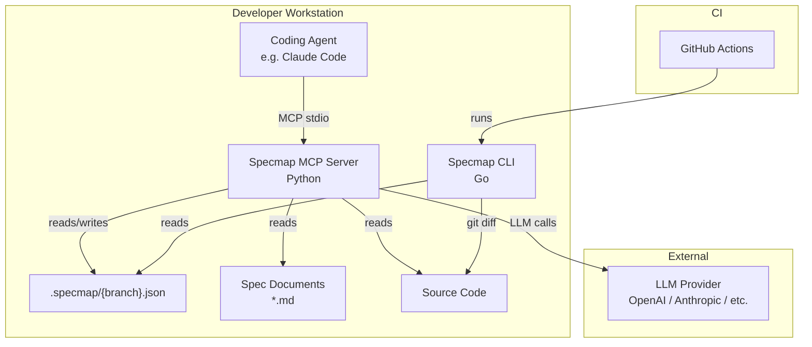
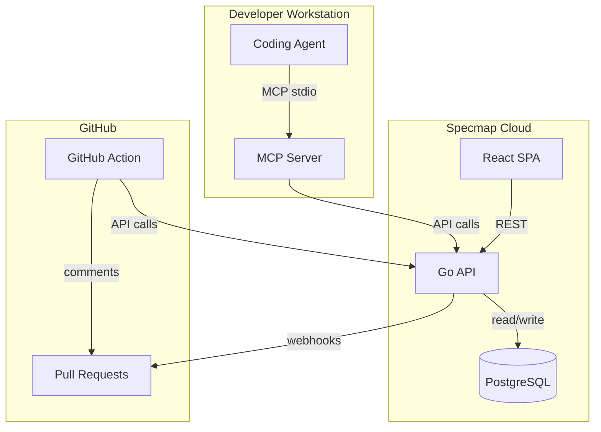

# Architecture

## System Diagram

## Data Flow

1. **Agent changes code** — the coding agent creates or modifies source files
2. **MCP tool call** — the agent calls `specmap_map` via the MCP stdio protocol
3. **Diff & parse** — the MCP server runs `git diff` to find changes, parses spec documents into sections
4. **LLM mapping** — the server asks the LLM which spec spans describe the intent behind each code change
5. **Persist** — mappings are written to `.specmap/{branch}.json` as hashes and pointers
6. **CLI validates** — in CI, the CLI reads the specmap file, computes coverage against the base branch, and enforces a threshold

## Component Responsibilities

| Component | Language | Responsibility | Makes LLM calls? |
|---|---|---|---|
| MCP Server | Python | Create and maintain mappings | Yes |
| CLI | Go | Validate mappings, enforce coverage | No |
| `.specmap/` files | JSON | Store mappings (hashes + pointers only) | — |
| Spec documents | Markdown | Source of truth for requirements | — |

## Design Principles

**No text in `.specmap/`**
: The specmap file stores only hashes, file paths, and line ranges — never raw spec or code text. This keeps the file small, avoids duplication, and ensures the source files remain the single source of truth.

**BYOK (Bring Your Own Key)**
: The MCP server never bundles API keys or requires a specific provider. Users configure their preferred LLM via environment variables.

**Local-first (Phase 1)**
: No server, no database, no accounts. Everything runs on the developer's machine. The specmap file is committed to git alongside the code.

**Deterministic CLI**
: The CLI makes no network calls and no LLM calls. Its output is fully deterministic given the same inputs, making it reliable for CI.

## Future Architecture (Phase 2+)

Phase 2 adds a web UI, Go API server, and PostgreSQL for multi-user collaboration. Phase 3 adds interactive review and comment sync. Phase 4 adds a dedicated GitHub Action. See [Roadmap](../roadmap.md) for details.
