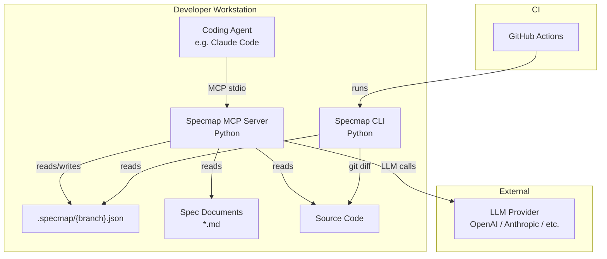
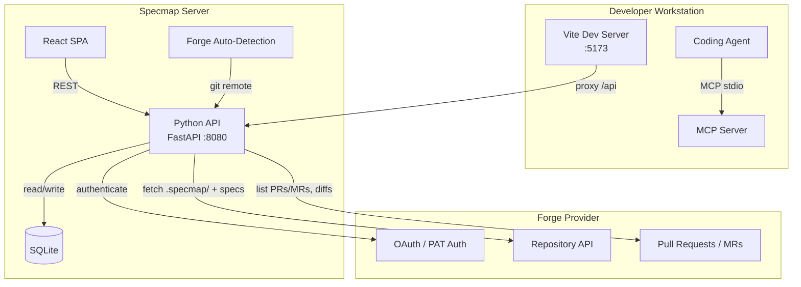

# Architecture

## System Diagram

## Data Flow

1. **Agent changes code** -- the coding agent creates or modifies source files
2. **MCP tool call** -- the agent calls `specmap_annotate` via the MCP stdio protocol
3. **Diff analysis** -- the MCP server runs `git diff` to find changes (full diff on first push, incremental diff on subsequent pushes)
4. **LLM annotation** -- the server sends the diff and spec files to the LLM, which generates natural-language descriptions with `[N]` spec citations
5. **Persist** -- annotations are written to `.specmap/{branch}.json` with the current `head_sha`
6. **CLI validates** -- in CI, the CLI reads the specmap file and validates annotation line ranges

## Component Responsibilities

| Component | Language | Responsibility | Makes LLM calls? |
|---|---|---|---|
| MCP Server | Python | Generate and maintain annotations | Yes |
| CLI | Python | Validate annotations | No |
| `.specmap/` files | JSON | Store annotations with spec references | -- |
| Spec documents | Markdown | Source of truth for requirements | -- |

## Design Principles

**Annotations with spec citations**
: The specmap file stores natural-language descriptions of code regions with inline `[N]` references to spec locations. Spec excerpts provide context, but the spec documents remain the source of truth.

**BYOK (Bring Your Own Key)**
: The MCP server never bundles API keys or requires a specific provider. Users configure their preferred LLM via environment variables.

**Local-first (Phase 1)**
: No server, no database, no accounts. Everything runs on the developer's machine. The specmap file is committed to git alongside the code.

**Deterministic CLI**
: The CLI makes no network calls and no LLM calls. Its output is fully deterministic given the same inputs, making it reliable for CI.

## Phase 2 Architecture

Phase 2 adds a read-only web UI for reviewing PRs with spec annotations. The server auto-detects the forge provider (GitHub or GitLab) from `git remote origin` and supports two auth modes:

- **PAT mode** (default): Server pre-authenticates on startup using a personal access token from an environment variable or CLI tool (`gh`/`glab`). No login page needed.
- **OAuth mode**: For enterprise environments that restrict PATs. Users authenticate via OAuth in the browser.

Reviewers browse repos and PRs/MRs and see diffs with annotation widgets inline. Clicking a `[N]` citation opens the spec content in a side panel.

UI capabilities:

- **Layout modes** — inline, side-by-side, and auto (responsive, switches at 1400px viewport width)
- **Keyboard navigation** — `j`/`k` for files, `n`/`p` for annotations, `?` for help overlay
- **Annotation minimap** — right-edge dots for quick navigation to annotations
- **Hunk expansion** — click to expand hidden context between diff hunks, powered by the `file-source` API endpoint
- **Hover cross-highlighting** — hovering an annotation highlights its code lines and vice versa
- **File-source API** — `GET /api/v1/repos/{owner}/{repo}/pulls/{number}/file-source?path=...` returns raw file content for hunk expansion

The API server fetches `.specmap/{branch}.json` from the repo via the forge's file/contents API and caches the result in SQLite. Spec file content is fetched on demand when a reviewer opens a citation.

See [Roadmap](../roadmap.md) for the full phased delivery plan.
