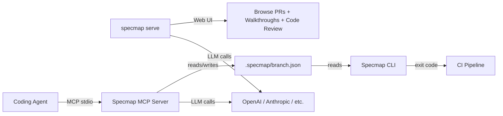

# Specmap

**Map AI-generated code changes back to spec intent.**

Specmap solves a fundamental problem with AI-assisted development: when an agent writes code, reviewers need to understand *which specification requirements* that code implements. Specmap generates LLM-powered annotations that describe code regions with inline spec citations, so every line of AI-generated code can be traced back to the intent behind it.

## How It Works

Run `specmap serve` to launch the **web UI**, where you can browse PRs with spec annotations overlaid on diffs, generate AI-powered walkthroughs, and run code reviews. The **MCP server** integrates with coding agents (e.g., Claude Code) to annotate code changes automatically as you work. The **CLI** validates annotations in CI and generates them from the command line.

## Key Features

- **Web UI** -- browse PRs with inline spec annotations, generate AI walkthroughs and code reviews, chat with an AI assistant about the changes
- **Annotations** -- LLM-generated natural-language descriptions of code regions, with `[N]` inline citations referencing specific spec locations
- **Walkthroughs** -- AI-guided narrative tours through a PR, building understanding step by step
- **Code review** -- AI-powered code review with severity ratings (P0-P4), suggested fixes, and per-issue chat
- **Diff-based optimization** -- first push annotates all changes; subsequent pushes use incremental diffs to keep, shift, or regenerate annotations
- **BYOK** -- bring your own key; supports any LLM provider via litellm

## Quick Links

| Getting started | Web UI | Reference | Deep dives |
|---|---|---|---|
| [Installation](getting-started/installation.md) | [Web UI Overview](web-ui/overview.md) | [CLI Commands](cli/commands.md) | [Architecture](concepts/architecture.md) |
| [Quick Start](getting-started/quickstart.md) | [Walkthroughs](web-ui/walkthroughs.md) | [MCP Tools](mcp/tools.md) | [Specmap Format](concepts/format.md) |
| [Configuration](getting-started/configuration.md) | [Code Review](web-ui/code-review.md) | [LLM Integration](mcp/llm.md) | [Diff-Based Optimization](concepts/hashing.md) |
