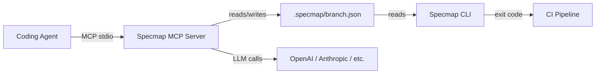

# Specmap

**Map AI-generated code changes back to spec intent.**

Specmap solves a fundamental problem with AI-assisted development: when an agent writes code, reviewers need to understand *which specification requirements* that code implements. Specmap generates LLM-powered annotations that describe code regions with inline spec citations, so every line of AI-generated code can be traced back to the intent behind it.

## How It Works

The **MCP server** integrates with your coding agent (e.g., Claude Code) to automatically annotate code changes with spec references as you work. The **CLI** validates those annotations in CI. The **web UI** lets reviewers browse PRs with spec annotations overlaid on diffs.

## Key Concepts

- **Annotations** -- LLM-generated natural-language descriptions of code regions, with `[N]` inline citations referencing specific spec locations
- **Diff-based optimization** -- first push annotates all changes; subsequent pushes use incremental diffs to keep, shift, or regenerate annotations
- **BYOK** -- bring your own key; the MCP server calls your preferred LLM provider via litellm

## Quick Links

| Getting started | Reference | Deep dives |
|---|---|---|
| [Installation](getting-started/installation.md) | [MCP Tools](mcp/tools.md) | [Architecture](concepts/architecture.md) |
| [Quick Start](getting-started/quickstart.md) | [CLI Commands](cli/commands.md) | [Specmap Format](concepts/format.md) |
| [Configuration](getting-started/configuration.md) | [LLM Integration](mcp/llm.md) | [Diff-Based Optimization](concepts/hashing.md) |
