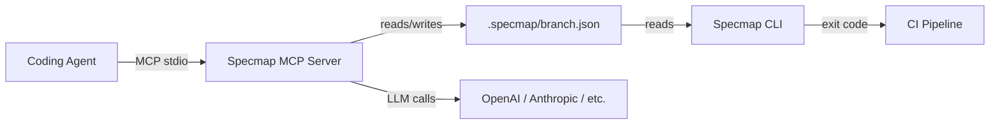

# Specmap

**Map AI-generated code changes back to spec intent.**

Specmap solves a fundamental problem with AI-assisted development: when an agent writes code, reviewers need to understand *which specification requirements* that code implements. Specmap creates and maintains traceable mappings between spec documents and code changes, so every line of AI-generated code can be traced back to the intent behind it.

## How It Works

The **MCP server** integrates with your coding agent (e.g., Claude Code) to automatically map code changes to spec sections as you work. The **CLI** validates those mappings in CI, enforcing a coverage threshold to ensure nothing slips through unreviewed.

## Key Concepts

- **Mappings** — links between specific spec text spans and code line ranges, stored as hashes (never raw text)
- **Coverage** — the percentage of changed lines (vs. base branch) that have spec mappings
- **Reindexing** — automatic relocation of mappings when specs or code shift, using fuzzy matching
- **BYOK** — bring your own key; the MCP server calls your preferred LLM provider via litellm

## Quick Links

| Getting started | Reference | Deep dives |
|---|---|---|
| [Installation](getting-started/installation.md) | [MCP Tools](mcp/tools.md) | [Architecture](concepts/architecture.md) |
| [Quick Start](getting-started/quickstart.md) | [CLI Commands](cli/commands.md) | [Specmap Format](concepts/format.md) |
| [Configuration](getting-started/configuration.md) | [LLM Integration](mcp/llm.md) | [Hashing & Reindexing](concepts/hashing.md) |
